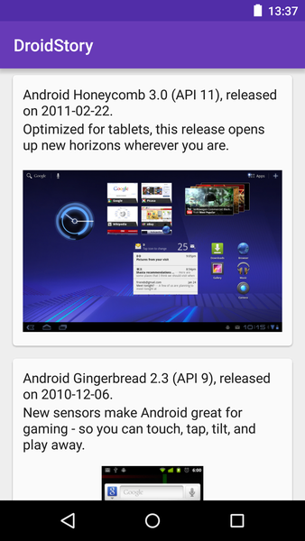

# droidstory

Sample app showcasing several best practices for integrating [Vault][vault] in an Android project.

Libraries
---------
* Vault - https://github.com/contentful/vault
* Butter Knife - https://github.com/JakeWharton/butterknife
* Picasso - https://github.com/square/picasso
* RxJava - https://github.com/ReactiveX/RxJava
* RxAndroid - https://github.com/ReactiveX/RxAndroid
* retrolambda - https://github.com/orfjackal/retrolambda

Plugins
-------
* android-apt - https://bitbucket.org/hvisser/android-apt
* gradle-retrolambda - https://github.com/evant/gradle-retrolambda

[vault]: https://github.com/contentful/vault

License
-------

    Copyright 2015 Contentful, GmbH.

    Licensed under the Apache License, Version 2.0 (the "License");
    you may not use this file except in compliance with the License.
    You may obtain a copy of the License at

       http://www.apache.org/licenses/LICENSE-2.0

    Unless required by applicable law or agreed to in writing, software
    distributed under the License is distributed on an "AS IS" BASIS,
    WITHOUT WARRANTIES OR CONDITIONS OF ANY KIND, either express or implied.
    See the License for the specific language governing permissions and
    limitations under the License.
    
